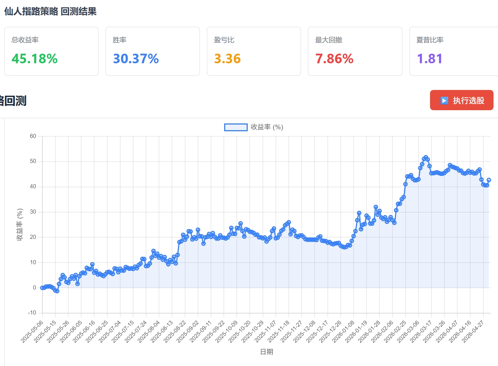

# KHunter - 开箱即用的A股量化交易系统


KHunter 是一套**开箱即用的A股量化交易系统**，集数据管理、策略选股、择时交易、风险控制、回测验证于一体，为个人投资者提供从数据到交易的全流程量化解决方案。


## ✨ 核心优势

### 🎯 多策略选股和择时
- **13种选股策略** - 覆盖底部反转、趋势加速、形态突破等多个维度
- **5种择时策略** - 辅助判断买卖时机，新增顺势宝策略
- **策略灵活组合** - 支持多策略组合，精准捕捉投资机会

### 📊 完整的数据支持
- **5000+只A股数据** - 覆盖全市场股票，支持最多三年历史数据回溯
- **智能数据更新** - 自动判断更新时机，避免不必要的网络请求
- **多层降级机制** - 确保数据获取的稳定性和可用性

### 🌐 可视化管理界面
- **Web管理系统** - 实时查看股票数据、执行选股、分析结果
- **K线图可视化** - 为每只入选股票生成K线图，直观展示技术形态
- **策略参数配置** - 在线修改策略参数



### 🔒 风险控制
- **VaR风险控制** - 基于VaR的风险评估和仓位管理
- **自动风险过滤** - 自动排除ST股、退市股、市值过低股票、近期涨幅过高等高风险标的

## 📈 股票评分系统

KHunter采用**五维度综合评分模型**，从多个角度全面评估股票投资价值。

### 五维度评分体系

| 维度 | 权重 | 评分范围 | 说明 |
|------|------|--------|------|
| **技术面** | 35% | 不限 | 策略命中情况，权重累加 |
| **资金面** | 35% | -100~100 | 资金流向分析，最重要指标 |
| **基本面** | 10% | -60~+60 | 财务指标分析，排雷为主 |
| **板块强度** | 10% | -100~+200 | 所属板块表现，顺势而为 |
| **事件驱动** | 10% | -100~+100 | 重大事件催化，短期机会 |

### 狩猎场使用流程

1. **执行选股** - 运行选股策略，获得初步候选股票
2. **排名评分** - 对选股结果进行五维评分和排名
3. **筛选过滤** - 按评分等级、支撑位等条件筛选
4. **狩猎场展示** - 查看符合条件的优质股票
5. **追踪管理** - 对狩猎场股票进行追踪和管理

### 📈 策略回测功能
- **回测配置** - 配置回测参数，包括策略选择、回测时间范围、资金管理等
- **回测执行** - 执行策略回测，模拟真实交易环境
- **结果分析** - 展示回测结果，包括收益率、胜率、最大回撤等指标
- **交易记录** - 查看详细的交易记录，了解策略表现
- **收益曲线** - 展示资金曲线，直观展示策略效果


### 🚀 开箱即用
- **一键启动** - 快速开始选股
- **完善的文档** - 详细的策略说明和使用指南
### 环境要求
- Python 3.8+
- pip 或 conda

### 安装步骤

```bash
# 1. 克隆项目
git clone https://github.com/ling-0729/KHunter.git
cd KHunter

# 2. 安装依赖
pip install -r requirements.txt

# 3. 启动Web界面
python main.py web
```
第2，3步也可以直接在windows下双击根目录下start.bat文件自动处理


## 🌐 Web界面功能

访问 `http://localhost:5001` 可使用以下功能：

- **系统概览** - 股票数量、最新数据日期、系统状态
- **股票列表** - 所有股票基本信息，支持搜索和分页
- **选股执行** - 执行选股并查看详细结果，支持多策略组合
- **策略配置** - 在线查看和修改策略参数
- **策略回测** - 配置和执行策略回测，查看回测结果
- **狩猎场** - 查看多维度评分的股票筛选结果
- **数据管理** - 查看数据更新状态，执行数据初始化和更新
- **看板功能** - 展示金股、热门行业和板块分布
- **策略运行器** - 策略自动化执行（需配置文件）

初次使用必须执行的功能：
初始化数据，数据更新
日常每天收盘后执行数据更新，增量更新最新k线数据
通过查询基础数据和首页的数据最新日期，股票数量等信息可以验证数据准备情况
数据准备好了以后，可以通过执行选股功能，按策略选股，并保存选股结果
选股完成后，可以通过选股排名功能，对选股结果进行五维分析，并对结果排名
对于选股结果，通过分数阈值和跟踪天数过滤，对当前价格和支撑位价格比较分析，对于符合条件的股票筛选到狩猎场
可以对排名靠前的股票，狩猎场股票进行跟踪，便于调整策略参数，迭代优化策略，有一定开发基础的朋友可以自己扩展策略
可以对策略进行历史数据回测，便于进一步优化策略

**注意**：由于免费数据源的稳定性问题，经过测试，策略选股功能可以稳定使用，但是由于选股排名和狩猎场等功能依赖于除k线以外的如资金面，基本面，板块，事件等数据，可能存在数据无法稳定获取的情况，对功能有一定影响。一方面开发者积极探索稳定数据源，另一方面可以通过注册tushare获取api token解决数据稳定性问题，完整功能需要6000积分，带来的困扰请理解。

## 📊 13种选股策略

| # | 策略名称 | 核心逻辑 | 适用场景 |
|----|---------|--------|--------|
| 1 | **底部趋势拐点** | 深度下跌后的反转拐点 | 极端底部 |
| 2 | **涨停回马枪策略** | 涨停后回调再次启动 | 短期强势 |
| 3 | **涨停横盘策略** | 涨停后横盘整理突破 | 突破选股 |
| 4 | **启明星策略** | 三根K线底部反转形态 | 底部反转 |
| 5 | **多金叉共振** | 均线/KDJ/MACD金叉共振 | 多头共振 |
| 6 | **多方炮策略** | 两阳夹一阴K线组合 | 短期反弹 |
| 7 | **阻力位突破策略** | 股价突破关键阻力位 | 突破选股 |
| 8 | **强势洗盘弱转强** | 强势股洗盘后转强 | 趋势反转 |
| 9 | **趋势加速拐点** | 上升趋势中的加速拐点 | 趋势加速 |
| 10 | **仙人指路策略** | 长上影线突破形态 | 突破选股 |
| 11 | **W底策略** | W底双底反转形态 | 双底反转 |
| 12 | **趋势起点策略** | 趋势启动初期识别 | 趋势启动 |
| 13 | **2560战法** | 基于特定K线形态的选股策略 | 形态突破 |

## ⏰ 5种择时策略

| # | 策略名称 | 核心逻辑 | 适用场景 |
|----|---------|--------|--------|
| 1 | **布林带策略** | 基于布林带上下轨判断买卖时机 | 震荡行情 |
| 2 | **RSI策略** | 基于相对强弱指数判断超买超卖 | 短线交易 |
| 3 | **支撑位策略** | 基于支撑位和压力位判断买卖 | 波段操作 |
| 4 | **海龟策略** | 基于ATR的突破和仓位管理 | 趋势交易 |
| 5 | **顺势宝策略** | MACD金叉 + 布林带上穿中轨 | 趋势跟随 |

### 策略参数配置

可以前端功能调整策略参数。每个策略都有独立的参数配置，支持在线修改。


## 🛠️ 技术栈

- **Python 3.8+** - 核心语言
- **akshare** - A股实时/历史数据获取
- **pandas/numpy** - 数据处理与技术指标计算
- **matplotlib** - K线图生成
- **Flask** - Web管理界面
- **SQLite** - 数据存储

## 📁 项目结构

```
├── main.py                      # 主程序入口
├── web_server.py                # Web服务器
├── stock_analyzer/              # 股票分析器模块
│   ├── data_fetcher.py          # 数据获取
│   ├── technical_analyzer.py    # 技术分析
│   ├── fundamental_analyzer.py  # 基本面分析
│   ├── sector_analyzer.py       # 行业分析
│   ├── fund_flow_analyzer.py    # 资金流分析
│   ├── event_analyzer.py        # 事件分析
│   └── report_generator.py      # 报告生成
├── strategy/                    # 策略模块
│   ├── __init__.py              # 初始化文件
│   ├── base_strategy.py         # 策略基类
│   ├── bottom_trend_inflection.py  # 底部趋势拐点
│   ├── limit_up_pullback_strategy.py  # 涨停回马枪策略
│   ├── limit_up_sideways_strategy.py  # 涨停横盘策略
│   ├── morning_star.py          # 启明星策略
│   ├── multi_golden_cross.py    # 多金叉共振
│   ├── multi_party_cannon.py    # 多方炮策略
│   ├── resistance_breakout.py   # 阻力位突破策略
│   ├── strong_wash_weak_to_strong.py  # 强势洗盘弱转强
│   ├── trend_acceleration_inflection.py  # 趋势加速拐点
│   ├── immortal_guidance_strategy.py  # 仙人指路策略
│   ├── w_bottom_strategy.py     # W底策略
│   ├── trend_start_strategy.py  # 趋势起点策略
│   ├── strategy_2560_selection.py  # 2560战法
│   ├── parallel_strategy_executor.py  # 并行策略执行器
│   ├── strategy_registry.py     # 策略注册表
│   └── ...                      # 其他策略相关文件
├── trading/                     # 交易和评分模块
│   ├── __init__.py              # 初始化文件
│   ├── backtest_engine.py       # 回测引擎
│   ├── backtest_dao.py          # 回测数据访问
│   ├── backtest_batch_queue.py  # 批量回测队列
│   ├── routes.py                # API路由
│   ├── khunter_api.py           # 狩猎场API
│   ├── khunter_dao.py           # 狩猎场数据访问
│   ├── khunter_data_processor.py  # 狩猎场数据处理
│   ├── khunter_support_calculator.py  # 狩猎场支撑位计算
│   ├── khunter_buy_point_judge.py  # 狩猎场买点判断
│   ├── stock_score_calculator.py  # 股票评分计算
│   ├── stock_score_dao.py       # 股票评分数据访问
│   ├── stock_score_api.py       # 股票评分API
│   ├── strategy_execution_plan.py  # 策略执行计划
│   ├── strategy_runner.py       # 策略运行器
│   ├── macd_bollinger_strategy.py  # 顺势宝策略
│   └── ...
├── utils/                       # 工具模块
│   ├── akshare_fetcher.py       # AKShare数据获取
│   ├── csv_manager.py           # CSV数据管理
│   ├── technical.py             # 技术指标
│   ├── kline_chart.py           # K线图生成
│   ├── log_config.py            # 日志配置与自动清理
│   ├── risk_manager.py          # 风险管理
│   ├── risk_controller.py       # 风险控制器
│   ├── var_calculator.py        # VaR计算器
│   ├── risk_config_loader.py    # 风险配置加载器
│   └── ...
├── config/                      # 配置文件
│   ├── config.yaml              # 主配置
│   ├── strategy_params.yaml     # 策略参数
│   ├── strategy_order.yaml      # 策略顺序
│   ├── strategy_weights.json    # 策略权重
│   ├── risk_config.yaml         # 风险配置
│   └── ...
├── web/                         # Web前端
│   ├── templates/               # HTML模板
│   └── static/                  # 静态资源
├── data/                        # 数据库脚本
│   ├── DataSql.sql              # 数据库结构脚本
│   └── InitData.sql             # 初始化数据脚本
└── doc/                         # 文档
```

## ⚙️ 配置说明

### 配置文件

- **主配置文件** (`config/config.yaml`) - 系统级配置，包括数据获取、选股和Web服务设置
- **策略参数配置** (`config/strategy_params.yaml`) - 各策略的参数配置
- **策略顺序配置** (`config/strategy_order.yaml`) - 策略执行顺序
- **策略权重配置** (`config/strategy_weights.json`) - 策略权重设置
- **风险配置** (`config/risk_config.yaml`) - 风险控制参数配置

详细配置说明请参考各配置文件中的注释。

## 🔄 智能数据更新

系统采用智能更新策略：

1. **3点前** - 不更新，使用本地已有数据
2. **3点后** - 检查每只股票是否有当天数据
3. **100%有当天数据** - 跳过更新，直接使用
4. **否则** - 执行增量更新

这样既能保证数据的及时性，又能避免不必要的网络请求。为保证数据完整准确，建议16：00后执行更新。

## 🔧 扩展新策略

### 创建新策略

1. 在 `strategy/` 目录创建新文件，继承 `BaseStrategy`
2. 实现 `calculate_indicators()` 和 `select_stocks()` 方法
3. 在 `config/strategy_params.yaml` 添加参数
4. 系统自动识别并执行

示例：
```python
from strategy.base_strategy import BaseStrategy

class MyStrategy(BaseStrategy):
    def __init__(self, params=None):
        super().__init__("我的策略", params)
    
    def calculate_indicators(self, df):
        # 计算指标
        return df
    
    def select_stocks(self, df, stock_name=''):
        # 选股逻辑
        return signals
```

## ⚠️ 免责声明
1. **本项目仅供学习和研究使用**，不构成任何投资建议。
2. **筛选结果仅为技术指标计算结果**，不代表对任何股票的推荐或预测。
3. **过往表现不代表未来收益**，股市有风险，投资需谨慎。
4. **使用者应基于独立判断进行投资决策**，因使用本项目产生的任何投资损失，作者不承担任何责任。
5. **本项目按“原样”提供**，不附带任何明示或暗示的保证，包括但不限于适销性、特定用途适用性的保证。

📄 License
本项目基于 MIT 许可证开源，详见 LICENSE 文件。
特别致谢原项目 a-share-quant-selector 的作者 Dzy-HW-XD，本项目在其优秀的基础架构上扩展开发。

🙏 致谢
感谢以下开源项目：

a-share-quant-selector - 原项目基础架构

akshare - A股数据获取库

pandas - 数据处理库

Flask - Web框架

GitHub: https://github.com/ling-0729/khunter

## 📫 联系与交流

如需获取项目更新、技术文档详细介绍、和作者深度交流，请访问飞书文档：

👉 [KHunter - 项目与技术交流入口](https://my.feishu.cn/wiki/NSOrwyfRNi6OhVkRiNucoL30nAh?from=from_copylink)